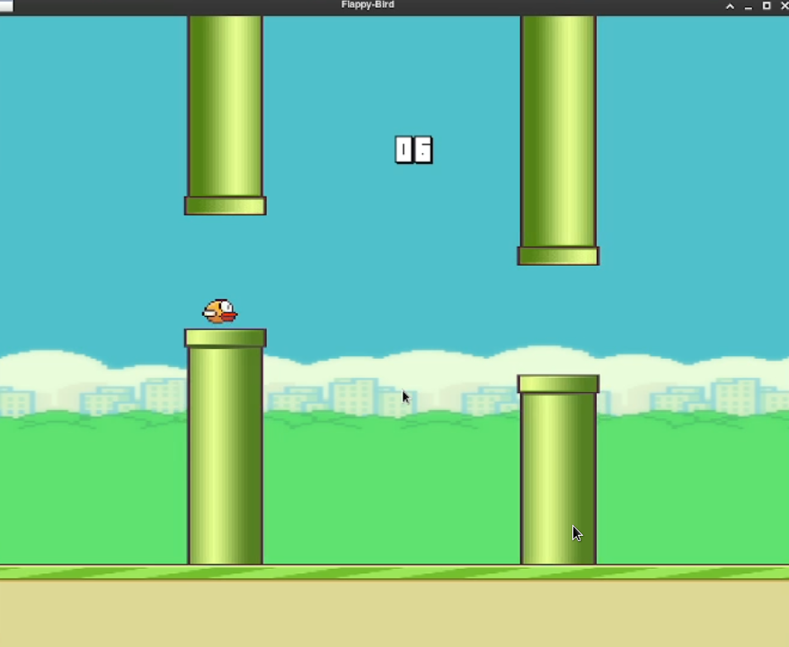
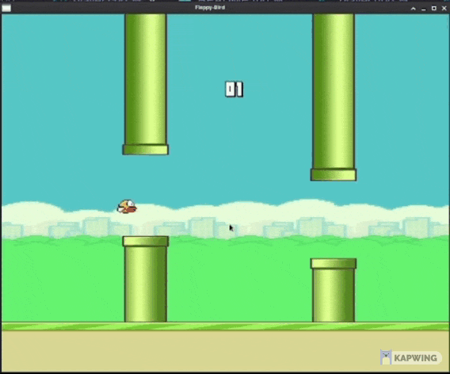

# Flappy Bird
Flappy Bird game made in C++ using SFML library.

The final image of the game is as shown below:



**For further images see [images](./Final_Images).** 

The assets for the game are gotten from [here](https://github.com/samuelcust/flappy-bird-assets).




#### Installation :

For running in your own machine follow the following steps:
( Currently just runs in linux using GCC compiler and Makefile )

1. Download the project 
2. cd into flappy-bird
```
$ cd flappy-bird
```
3. Then run:
``` 
$ make && ./game
```
4. Enjoy

